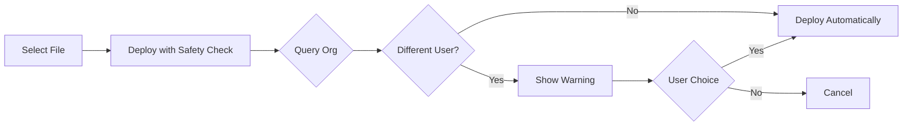

# SFDX Deploy Guard

This VS Code extension adds a safety check before deploying Salesforce metadata to prevent accidentally overwriting changes made by other team members.

## Features

- Adds a new command: **"SFDX: Deploy This Source to Org (with Safety Check)"**
- Queries the target org to check who last modified the metadata
- Shows a warning dialog if the file was recently changed by a different user
- Allows you to proceed or cancel the deployment
- Works alongside the standard SFDX deploy commands

## How It Works

1. Right-click on a Salesforce file and select **"SFDX: Deploy This Source to Org (with Safety Check)"**
2. The extension queries the target org for the `LastModifiedBy.Name` field
3. If the last modifier is different from the current user:
   - A warning dialog appears: "<div align="center">

# 🛡️ SFDX Deploy Guard

### Prevent Accidental Overwrites in Salesforce Development

[](https://github.com/miguelgpunzal/sfdx-deploy-guard-extension)
[](LICENSE)
[](https://code.visualstudio.com/)
[](https://www.salesforce.com/)

**A VS Code extension that adds intelligent safety checks before deploying Salesforce metadata, protecting your team from accidental overwrites.**

[Features](#-features) • [Installation](#-installation) • [Usage](#-usage) • [Configuration](#-configuration) • [Contributing](#-contributing)

</div>

---

## 🎯 Why SFDX Deploy Guard?

Working in a team environment? Tired of accidentally overwriting a teammate's changes? **SFDX Deploy Guard** acts as your safety net by checking who last modified a file before you deploy, giving you the chance to avoid conflicts before they happen.

### The Problem
- 😰 You deploy a file, only to realize a teammate just made critical changes
- 🔄 Constant merge conflicts and overwritten work
- ⏰ Time wasted recovering lost changes
- 😤 Team frustration and reduced productivity

### The Solution
**SFDX Deploy Guard** queries your Salesforce org in real-time to check the last modifier before deployment, showing you a clear warning if someone else has recently changed the file.

---

## ✨ Features

<table>
<tr>
<td width="50%">

### 🔍 Smart Detection
- Real-time query of org metadata
- Identifies last modifier and timestamp
- Works with multiple metadata types
- Integrates seamlessly with SFDX workflow

</td>
<td width="50%">

### 🚨 Intelligent Warnings
- Clear, actionable warning dialogs
- Shows who modified and when
- Proceed or cancel options
- Prevents accidental overwrites

</td>
</tr>
<tr>
<td width="50%">

### ⚙️ Configurable
- Enable/disable safety checks
- Customize warning behavior
- Works alongside existing commands
- Non-intrusive integration

</td>
<td width="50%">

### 🎨 Developer Friendly
- Context menu integration
- Command palette support
- Keyboard shortcuts compatible
- Minimal setup required

</td>
</tr>
</table>

---

## 🚀 Installation

### Prerequisites
- **VS Code** 1.80.0 or higher
- **Salesforce CLI** (sf or sfdx)
- **Salesforce Extensions Pack** (recommended)
- Active Salesforce org connection

### Quick Install

1. **Clone the repository:**
   ```bash
   git clone https://github.com/miguelgpunzal/sfdx-deploy-guard-extension.git
   cd sfdx-deploy-guard-extension
   ```

2. **Install dependencies:**
   ```bash
   npm install
   ```

3. **Compile the extension:**
   ```bash
   npm run compile
   ```

4. **Open in VS Code and press F5** to run in debug mode

> 💡 **Tip:** See [SETUP.md](./SETUP.md) for detailed development instructions.

---

## 📖 Usage

### Quick Start Guide

<details open>
<summary><b>📂 From Context Menu</b></summary>

1. Right-click on any Salesforce metadata file
2. Select **"SFDX: Deploy This Source to Org (with Safety Check)"**
3. The extension checks the org for recent changes
4. If a conflict is detected, you'll see a warning:

```
⚠️ Warning: This file was recently changed by Jane Smith on 10/24/2025, 2:30:00 PM.

Do you want to overwrite the changes?

[Yes]  [No]
```

5. Choose **Yes** to proceed or **No** to cancel

</details>

<details>
<summary><b>⌨️ From Command Palette</b></summary>

1. Press `Ctrl+Shift+P` (Windows/Linux) or `Cmd+Shift+P` (Mac)
2. Type: **"SFDX: Deploy This Source to Org (with Safety Check)"**
3. Press Enter
4. Follow the prompts

</details>

### 📋 Supported Metadata Types

| Type | Extension | Status |
|------|-----------|--------|
| Apex Classes | `.cls` | ✅ Fully Supported |
| Apex Triggers | `.trigger` | ✅ Fully Supported |
| Apex Pages | `.page` | ✅ Fully Supported |
| Apex Components | `.component` | ✅ Fully Supported |
| Lightning Web Components | `.js`, `.html`, `.css` | 🔄 Limited Support |
| Aura Components | `.cmp` | 🔄 Limited Support |

---

## ⚙️ Configuration

Configure the extension through VS Code settings (`Ctrl+,` or `Cmd+,`):

```json
{
  // Enable or disable the deploy guard check
  "sfdxDeployGuard.enabled": true,
  
  // Check last modified user before deploying
  "sfdxDeployGuard.checkLastModified": true
}
```

### Settings Reference

| Setting | Type | Default | Description |
|---------|------|---------|-------------|
| `sfdxDeployGuard.enabled` | boolean | `true` | Enable/disable the deploy guard check |
| `sfdxDeployGuard.checkLastModified` | boolean | `true` | Check last modified user before deploying |

---

## 🔧 How It Works



1. **File Selection**: Choose a Salesforce metadata file
2. **Safety Check**: Extension queries the org for `LastModifiedBy` information
3. **Conflict Detection**: Compares last modifier with current user
4. **Warning Display**: If different, shows warning with details
5. **User Decision**: Proceed or cancel deployment
6. **Deployment**: Executes standard SFDX deploy command

---

## 🎬 Demo

### Scenario: Preventing an Accidental Overwrite

```
You: [Right-click on AccountController.cls]
     [Select "SFDX: Deploy This Source to Org (with Safety Check)"]

Extension: [Queries org...]

⚠️ Warning Dialog:
┌─────────────────────────────────────────────────────────┐
│  This file was recently changed by:                     │
│  👤 Sarah Johnson                                        │
│  📅 10/24/2025, 3:45:00 PM                              │
│                                                          │
│  Deploying will overwrite their changes.                │
│  Do you want to proceed?                                │
│                                                          │
│           [Yes, Deploy]    [No, Cancel]                 │
└─────────────────────────────────────────────────────────┘

You: [Click "No, Cancel"]
     [Contact Sarah to merge changes first]
```

---

## 🛠️ Development

### Setup Development Environment

```bash
# Clone the repository
git clone https://github.com/miguelgpunzal/sfdx-deploy-guard-extension.git

# Navigate to project
cd sfdx-deploy-guard-extension

# Install dependencies
npm install

# Start watch mode
npm run watch

# Open in VS Code
code .

# Press F5 to start debugging
```

### Project Structure

```
sfdx-deploy-guard-extension/
├── src/
│   ├── extension.ts       # Main extension entry point
│   └── deployGuard.ts     # Core safety check logic
├── package.json           # Extension manifest
├── tsconfig.json          # TypeScript configuration
├── README.md              # This file
├── SETUP.md              # Development setup guide
└── QUICKSTART.md         # Quick start guide
```

### Building

```bash
# Compile TypeScript
npm run compile

# Watch for changes
npm run watch

# Run linter
npm run lint
```

---

## 📝 Release Notes

### Version 0.0.1 - Initial Release

**Features:**
- ✨ Safety check for Apex Classes, Triggers, Pages, and Components
- 🚨 Warning dialog with last modified user and timestamp
- ⚙️ Configurable settings for enabling/disabling checks
- 🎯 Context menu and command palette integration
- 📋 Support for multiple metadata types

**Coming Soon:**
- 🔄 Enhanced LWC and Aura component support
- 📊 Deployment history tracking
- 🔔 Customizable notification preferences
- 🌐 Multi-org support

---

## ⚠️ Known Limitations

- **LWC/Aura Components**: Cannot be directly queried via standard Salesforce objects (workaround in progress)
- **CLI Requirement**: Requires Salesforce CLI to be installed and configured
- **Single Org**: Currently only checks the default org
- **Network Dependent**: Requires active connection to Salesforce org

---

## 🤝 Contributing

Contributions are welcome! Here's how you can help:

### Reporting Issues
Found a bug? Have a feature request? [Open an issue](https://github.com/miguelgpunzal/sfdx-deploy-guard-extension/issues)

### Pull Requests
1. Fork the repository
2. Create your feature branch (`git checkout -b feature/amazing-feature`)
3. Commit your changes (`git commit -m 'Add some amazing feature'`)
4. Push to the branch (`git push origin feature/amazing-feature`)
5. Open a Pull Request

### Code of Conduct
- Be respectful and inclusive
- Follow TypeScript best practices
- Write clear commit messages
- Add tests for new features
- Update documentation as needed

---

## 📄 License

This project is licensed under the **MIT License** - see the [LICENSE](LICENSE) file for details.

---

## 👨‍💻 Author

**Miguel Punzal**

- GitHub: [@miguelgpunzal](https://github.com/miguelgpunzal)
- Project Link: [https://github.com/miguelgpunzal/sfdx-deploy-guard-extension](https://github.com/miguelgpunzal/sfdx-deploy-guard-extension)

---

## 🙏 Acknowledgments

- Thanks to the Salesforce Developer Community
- Built with the [VS Code Extension API](https://code.visualstudio.com/api)
- Powered by [Salesforce CLI](https://developer.salesforce.com/tools/sfdxcli)

---

<div align="center">

### ⭐ If you find this extension helpful, please star the repository!

**Made with ❤️ by Miguel Punzal**

[Report Bug](https://github.com/miguelgpunzal/sfdx-deploy-guard-extension/issues) • [Request Feature](https://github.com/miguelgpunzal/sfdx-deploy-guard-extension/issues) • [Documentation](https://github.com/miguelgpunzal/sfdx-deploy-guard-extension#readme)

</div>"
   - Select "Yes" to proceed with deployment
   - Select "No" to cancel
4. If no conflicts detected, deployment proceeds automatically

## Requirements

- Salesforce CLI (sf or sfdx) must be installed
- VS Code Salesforce Extensions Pack (recommended)
- Active Salesforce org connection
- Default org must be configured (`sf config set target-org <username>`)

## Extension Settings

This extension contributes the following settings:

* `sfdxDeployGuard.enabled`: Enable/disable the deploy guard check (default: true)
* `sfdxDeployGuard.checkLastModified`: Check last modified user before deploying (default: true)

## Usage

### From Context Menu
1. Right-click on an Apex class, trigger, page, or component file
2. Select **"SFDX: Deploy This Source to Org (with Safety Check)"**
3. Follow the prompts

### From Command Palette
1. Press `Ctrl+Shift+P` (Windows/Linux) or `Cmd+Shift+P` (Mac)
2. Type "SFDX: Deploy This Source to Org (with Safety Check)"
3. Press Enter

### Supported Metadata Types
- ✅ Apex Classes (`.cls`)
- ✅ Apex Triggers (`.trigger`)
- ✅ Apex Pages (`.page`)
- ✅ Apex Components (`.component`)
- 🔄 Lightning Web Components (LWC) - Limited support
- 🔄 Aura Components - Limited support

## Screenshot Example

```
⚠️ Warning: This file was recently changed by Jane Smith on 10/24/2025, 2:30:00 PM.

Do you want to overwrite the changes?

[Yes]  [No]
```

## Development

See [SETUP.md](./SETUP.md) for development instructions.

## Release Notes

### 0.0.1

Initial release:
- Safety check for Apex Classes, Triggers, Pages, and Components
- Warning dialog with last modified user and date
- Configurable settings

## Known Limitations

- LWC and Aura components cannot be directly queried via standard Salesforce objects
- Requires Salesforce CLI to be installed and configured
- Only checks the default org

## Contributing

Issues and pull requests welcome!

## License

MIT
