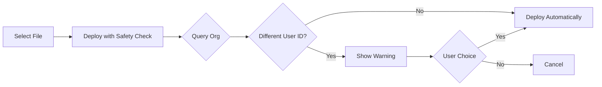

# SFDX Deploy Guard

This VS Code extension adds a safety check before deploying Salesforce metadata to prevent accidentally overwriting changes made by other team members.

## Features

- Adds a new command: **"SFDX: Deploy This Source to Org (with Safety Check)"**
- Queries the target org to check who last modified the metadata
- Shows a warning dialog if the file was recently changed by a different user
- Allows you to proceed or cancel the deployment
- Works alongside the standard SFDX deploy commands

## How It Works

1. Right-click on a Salesforce file and select **"SFDX: Deploy This Source to Org (with Safety Check)"**
2. The extension queries the target org for the `LastModifiedById` and `LastModifiedBy.Name` fields
3. If the last modifier's ID is different from the current user's ID:
   - A warning dialog appears showing the modifier's name and timestamp
   - Select "Deploy Anyway" to proceed with deployment
   - Select "Compare First" to see differences, then cancel
4. If no conflicts detected, deployment proceeds automatically

# SFDX Deploy Guard

A VS Code extension that prevents you from accidentally overwriting your teammate's changes when deploying Salesforce metadata.

## Why This Extension?

Ever deployed a file only to find out someone else just made important changes? This extension checks who last modified the file before you deploy and warns you if there's a potential conflict.

It also shows real-time updates in the status bar so you always know who touched the file last.

## Features

- **Deployment Safety Check**: Warns you before deploying if someone else modified the file
- **Real-Time Status Bar**: Shows who last modified the current file (updates while you type)
- **Visual Alerts**: Blinking status bar when there's a conflict
- **Side-by-Side Comparison**: View differences between local and org versions
- **Ignore Users**: Configure trusted user IDs that won't trigger warnings
- **Smart Polling**: Only checks for updates while you're actively editing
- **Supports 15+ Metadata Types**: Apex, LWC, Aura, Flows, Profiles, and more

## Installation

Install from the VS Code Marketplace: [SFDX Deploy Guard](https://marketplace.visualstudio.com/items?itemName=MiguelPunzal.sfdx-deploy-guard)

Or search for "SFDX Deploy Guard" in the VS Code Extensions panel.

### Requirements

- VS Code 1.80.0 or higher
- Salesforce CLI (sf or sfdx)
- Active Salesforce org connection

## Usage

### Basic Deployment

Right-click on a Salesforce file and select **"Deploy This Source to Org (with Safety Check)"**

If someone else modified the file, you'll see a warning:
```
⚠️ Warning: This file was recently changed by Jane Smith on 10/24/2025, 2:30:00 PM.

What would you like to do?
[Deploy Anyway]  [Compare First]
```

Choose **Deploy Anyway** to proceed or **Compare First** to see a side-by-side diff.

### 📋 Supported Metadata Types

| Type | Extension | Status |
|------|-----------|--------|
| Apex Classes | `.cls` | ✅ Fully Supported |
| Apex Triggers | `.trigger` | ✅ Fully Supported |
| Apex Pages | `.page` | ✅ Fully Supported |
| Apex Components | `.component` | ✅ Fully Supported |
| Lightning Web Components | `.js`, `.html`, `.css` | ✅ Fully Supported |
| Aura Components | `.cmp`, `.app`, `.js`, `.css` | ✅ Fully Supported |
| Custom Objects | `.object-meta.xml` | ✅ Fully Supported |
| Flows | `.flow-meta.xml` | ✅ Fully Supported |
| Profiles | `.profile-meta.xml` | ✅ Fully Supported |
| Permission Sets | `.permissionset-meta.xml` | ✅ Fully Supported |
| Layouts | `.layout-meta.xml` | ✅ Fully Supported |
| Static Resources | various | ✅ Fully Supported |
| Custom Labels | `.labels-meta.xml` | ✅ Fully Supported |
| Quick Actions | `.quickAction-meta.xml` | ✅ Fully Supported |
| Custom Tabs | `.tab-meta.xml` | ✅ Fully Supported |
| Flexi Pages | `.flexipage-meta.xml` | ✅ Fully Supported |
| Email Templates | `.email-meta.xml` | ✅ Fully Supported |

---

## ⚙️ Configuration

Configure the extension through VS Code settings (`Ctrl+,` or `Cmd+,`):

```json
{
  // Enable or disable the deploy guard check
  "sfdxDeployGuard.enabled": true,
  
  // Check last modified user before deploying
  "sfdxDeployGuard.checkLastModified": true,
  
  // Enable real-time monitoring (status bar and polling)
  "sfdxDeployGuard.enableRealTimeMonitoring": true,
  
  // Comma-separated list of User IDs to ignore
  "sfdxDeployGuard.ignoreUserIds": "0052w00000DINOKAA5,0052w00000ABCDEF"
}
```

### Settings Reference

| Setting | Type | Default | Description |
|---------|------|---------|-------------|
| `sfdxDeployGuard.enabled` | boolean | `true` | Enable/disable the deploy guard check |
| `sfdxDeployGuard.checkLastModified` | boolean | `true` | Check last modified user before deploying |
| `sfdxDeployGuard.enableRealTimeMonitoring` | boolean | `true` | Enable real-time monitoring with status bar and automatic polling |
| `sfdxDeployGuard.ignoreUserIds` | string | `""` | Comma-separated Salesforce User IDs to ignore (won't trigger warnings) |

---

## 🎯 Real-Time Monitoring

**NEW in v1.5.0!** The extension now includes a powerful real-time monitoring feature that keeps you informed about file modifications while you work.

### Status Bar Indicator

The extension adds a status bar item (bottom right) that shows:

- **`LastModifiedBy: You (date)`** - 🟢 You're the last modifier (safe to deploy)
- **`LastModifiedBy: John Doe (date)`** - 🔴🟡 Someone else modified it (blinking yellow/red alert!)

### Smart Polling Behavior

The monitoring is intelligent and resource-efficient:

1. **On File Open**: Checks immediately who last modified the file
2. **While Typing**: Polls every 10 seconds to detect changes
3. **After Stop Typing**: Continues polling 2 more times (20 seconds grace period)
4. **Then Pauses**: Automatically stops to save resources
5. **Resume on Edit**: Starts polling again when you start typing

### Visual Indicators

When someone else has modified the file:
- 🔴🟡 **Blinking Status Bar**: Alternates between yellow and red every second
- 🎨 **Editor Decorations**: Orange background highlight on first line
- 🚨 **Warning Icon**: Gutter icon indicator
- 💡 **Click for Details**: Click status bar item for full information

### After Deployment

When you deploy a file:
- Status bar automatically refreshes after 3 seconds
- Updates to show you as the last modifier
- Stops blinking and shows green/normal state

---

## 🔧 How It Works



1. **File Selection**: Choose a Salesforce metadata file
2. **Safety Check**: Extension queries the org for `LastModifiedById` and `LastModifiedBy.Name` information
3. **Conflict Detection**: Compares last modifier's user ID with current user's ID
4. **Warning Display**: If different, shows warning with the modifier's name and timestamp
5. **User Decision**: Proceed or cancel deployment
6. **Deployment**: Executes standard SFDX deploy command

---

## 🎬 Demo

### Scenario: Preventing an Accidental Overwrite

```
You: [Right-click on AccountController.cls]
     [Select "SFDX: Deploy This Source to Org (with Safety Check)"]

Extension: [Queries org...]

⚠️ Warning Dialog:
┌─────────────────────────────────────────────────────────┐
│  This file was recently changed by:                     │
│  👤 Sarah Johnson                                        │
│  📅 10/24/2025, 3:45:00 PM                              │
│                                                          │
│  Deploying will overwrite their changes.                │
│  Do you want to proceed?                                │
│                                                          │
│           [Yes, Deploy]    [No, Cancel]                 │
└─────────────────────────────────────────────────────────┘

You: [Click "No, Cancel"]
     [Contact Sarah to merge changes first]
```

---

## 🛠️ Development

### Setup Development Environment

```bash
# Clone the repository
git clone https://github.com/miguelgpunzal/sfdx-deploy-guard-extension.git

# Navigate to project
cd sfdx-deploy-guard-extension

# Install dependencies
npm install

# Start watch mode
npm run watch

# Open in VS Code
code .

# Press F5 to start debugging
```

### Project Structure

```
sfdx-deploy-guard-extension/
├── src/
│   ├── extension.ts       # Main extension entry point
│   └── deployGuard.ts     # Core safety check logic
├── package.json           # Extension manifest
├── tsconfig.json          # TypeScript configuration
└── README.md              # This file
```

### Building

```bash
# Compile TypeScript
npm run compile

# Watch for changes
npm run watch

# Run linter
npm run lint
```

---

## 📝 Release Notes

### Version 1.5.0 - Real-Time Monitoring & Enhanced Features

**🆕 New Features:**
- 📊 **Real-Time Monitoring**: Live status bar showing who last modified the file
- 🔄 **Smart Polling**: Auto-polls every 10 seconds while editing, pauses when inactive
- 🚨 **Blinking Alerts**: Status bar blinks yellow/red when someone else modified the file
- 🎨 **Visual Indicators**: Editor decorations and gutter icons for conflicts
- ⚙️ **Ignore Users**: Configure User IDs to ignore (no warnings for trusted users/bots)
- 🎯 **Auto-Refresh**: Status bar updates automatically after deployment
- 💡 **Click for Info**: Click status bar to see detailed modification information

**🐛 Bug Fixes:**
- Fixed User ID comparison (was comparing Org ID instead of User ID)
- Fixed deployment to target specific files only (not entire directory)
- Added feedback message when clicking "Deploy Anyway"
- Improved error handling and edge cases

**✨ Improvements:**
- Extended support to 15+ metadata types (Flows, Profiles, Layouts, etc.)
- Better side-by-side comparison for LWC and Aura components
- More efficient polling with grace period after typing stops
- Cleaner status bar messages with date/time always visible

### Version 1.4.0 - Deployment Improvements

**Features:**
- Added feedback message when clicking "Deploy Anyway"
- Improved deployment flow and error handling

### Version 1.3.0 - User ID Fix

**Bug Fixes:**
- Fixed User ID comparison to query actual User ID instead of Org ID
- Now correctly identifies when you are the last modifier

### Version 1.2.0 - Universal Metadata Support

**Features:**
- Added support for all metadata types via `sf org list metadata`
- Support for CustomObject, Flow, Profile, PermissionSet, and more
- Fallback mechanism for metadata types not in Tooling API

### Version 1.1.0 - Precise Deployment

**Features:**
- Fixed deployment to target specific files using `--metadata` flag
- No more accidental directory deployments

### Version 1.0.0 - LWC & Aura Support

**Features:**
- Full support for Lightning Web Components
- Full support for Aura Components
- Tooling API integration for bundle-based components

### Version 0.0.1 - Initial Release

**Features:**
- ✨ Safety check for Apex Classes, Triggers, Pages, and Components
- 🚨 Warning dialog with last modified user and timestamp
- ⚙️ Configurable settings for enabling/disabling checks
- 🎯 Context menu and command palette integration
- 📋 Support for multiple metadata types including LWC and Aura
- 🔒 Compares users by ID for accurate conflict detection
- 🔍 Side-by-side comparison view for all supported metadata types

**Coming Soon:**
- 📈 Deployment history tracking
- 🔔 Customizable notification preferences
- 🌐 Multi-org support
- 📝 Additional metadata type support

---

## ⚠️ Known Limitations

- **CLI Requirement**: Requires Salesforce CLI to be installed and configured
- **Single Org**: Currently only checks the default org
- **Network Dependent**: Requires active connection to Salesforce org
- **Tooling API**: LWC and Aura components require Tooling API access

---

## 🤝 Contributing

Contributions are welcome! Here's how you can help:

### Reporting Issues
Found a bug? Have a feature request? [Open an issue](https://github.com/miguelgpunzal/sfdx-deploy-guard-extension/issues)

### Pull Requests
1. Fork the repository
2. Create your feature branch (`git checkout -b feature/amazing-feature`)
3. Commit your changes (`git commit -m 'Add some amazing feature'`)
4. Push to the branch (`git push origin feature/amazing-feature`)
5. Open a Pull Request

### Code of Conduct
- Be respectful and inclusive
- Follow TypeScript best practices
- Write clear commit messages
- Add tests for new features
- Update documentation as needed

---

## 📄 License

This project is licensed under the **MIT License** - see the [LICENSE](LICENSE) file for details.

---

## 👨‍💻 Author

**Miguel Punzal**

- GitHub: [@miguelgpunzal](https://github.com/miguelgpunzal)
- Project Link: [https://github.com/miguelgpunzal/sfdx-deploy-guard-extension](https://github.com/miguelgpunzal/sfdx-deploy-guard-extension)

---

## 🙏 Acknowledgments

- Thanks to the Salesforce Developer Community
- Built with the [VS Code Extension API](https://code.visualstudio.com/api)
- Powered by [Salesforce CLI](https://developer.salesforce.com/tools/sfdxcli)

---

<div align="center">

### ⭐ If you find this extension helpful, please star the repository!

**Made with ❤️ by Miguel Punzal**

[Report Bug](https://github.com/miguelgpunzal/sfdx-deploy-guard-extension/issues) • [Request Feature](https://github.com/miguelgpunzal/sfdx-deploy-guard-extension/issues) • [Documentation](https://github.com/miguelgpunzal/sfdx-deploy-guard-extension#readme)

</div>"
   - Select "Yes" to proceed with deployment
   - Select "No" to cancel
4. If no conflicts detected, deployment proceeds automatically

## Requirements

- Salesforce CLI (sf or sfdx) must be installed
- VS Code Salesforce Extensions Pack (recommended)
- Active Salesforce org connection
- Default org must be configured (`sf config set target-org <username>`)

## Extension Settings

This extension contributes the following settings:

* `sfdxDeployGuard.enabled`: Enable/disable the deploy guard check (default: true)
* `sfdxDeployGuard.checkLastModified`: Check last modified user before deploying (default: true)

## Usage

### From Context Menu
1. Right-click on an Apex class, trigger, page, or component file
2. Select **"SFDX: Deploy This Source to Org (with Safety Check)"**
3. Follow the prompts

### From Command Palette
1. Press `Ctrl+Shift+P` (Windows/Linux) or `Cmd+Shift+P` (Mac)
2. Type "SFDX: Deploy This Source to Org (with Safety Check)"
3. Press Enter

### Supported Metadata Types
- ✅ Apex Classes (`.cls`)
- ✅ Apex Triggers (`.trigger`)
- ✅ Apex Pages (`.page`)
- ✅ Apex Components (`.component`)
- 🔄 Lightning Web Components (LWC) - Limited support
- 🔄 Aura Components - Limited support

## Screenshot Example

```
⚠️ Warning: This file was recently changed by Jane Smith on 10/24/2025, 2:30:00 PM.

Do you want to overwrite the changes?

[Yes]  [No]
```

## Development

See [SETUP.md](./SETUP.md) for development instructions.

## Release Notes

### 0.0.1

Initial release:
- Safety check for Apex Classes, Triggers, Pages, and Components
- Warning dialog with last modified user and date
- Configurable settings

## Known Limitations

- LWC and Aura components cannot be directly queried via standard Salesforce objects
- Requires Salesforce CLI to be installed and configured
- Only checks the default org

## Contributing

Issues and pull requests welcome!

## License

MIT
